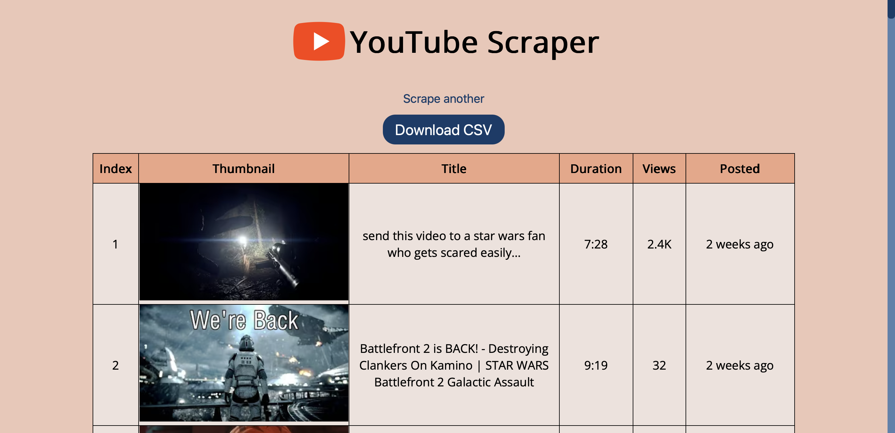

# 📺 YouTube Channel Scraper

A sleek and simple web app built with **Flask**, **Selenium**, and **JavaScript** that scrapes videos from a YouTube channel (e.g. `https://www.youtube.com/@channel/videos`) and exports them to a CSV file.



---

## 🚀 Features

- Scrapes video details using Selenium (title, views, posted date, etc.)
- Frontend URL validation using JavaScript
- Clean loading screen while scraping
- CSV export and download option
- Responsive UI with dark theme

---

## 🛠️ Tech Stack

- **Frontend**: HTML, CSS, JavaScript
- **Backend**: Python (Flask)
- **Scraping**: Selenium WebDriver

---

## 📦 Installation

1. **Clone the repository**
   ```bash
   git clone https://github.com/your-username/youtube-scraper.git
   cd youtube-scraper
   ```

2. **Set up a virtual environment (recommended)**
   ```bash
   python -m venv venv
   source venv/bin/activate  # On Windows: venv\Scripts\activate
   ```

3. **Install dependencies**
   ```bash
   pip install -r requirements.txt
   ```

4. **Run the Flask app**
   ```bash
   python app.py
   ```

5. **Open your browser**  
   Go to `http://127.0.0.1:5000/` to start scraping!

---

## 📁 Project Structure

```
youtube-scraper/
│
├── templates/
│   └── base.html
│   └── index.html
│   └── loading.html
│   └── results.html
│
├── static/
│   └── script.js
│   └── styles.css
│   └── youtube.svg
│
├── app.py
├── scraper.py
├── requirements.txt
└── screenshot.png
```

---
